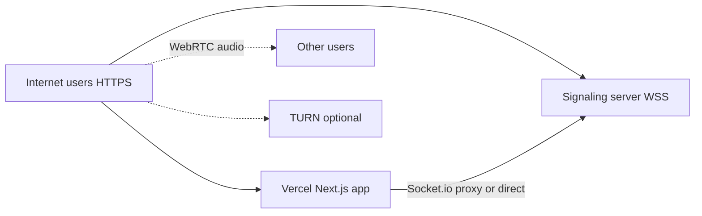

# VoiceLink — Production deployment (Vercel + global internet users)

Deploy so **anyone on the internet** can use VoiceLink over **HTTPS** (microphone works worldwide), with public signaling and optional TURN for voice.

| Layer | Host | Why |
|-------|------|-----|
| **Web** | [Vercel](https://vercel.com) | HTTPS CDN, `https://your-app.vercel.app` |
| **Signaling** | Railway / Render / Fly / VPS | Long-lived WebSocket server (not serverless) |
| **TURN** (recommended) | Metered, Twilio, self-hosted coturn | Voice when P2P UDP fails |

---

## Architecture (production)



**Recommended:** Vercel app + deploy `server/` + set **`SIGNALING_PROXY_TARGET`** (with `NEXT_PUBLIC_SOCKET_URL=auto`).

---

## Part 1 — Deploy signaling server

### Railway (example)

1. New project → deploy from repo, set **root directory** to `server/`.
2. **Environment variables:**

| Variable | Value |
|----------|--------|
| `NODE_ENV` | `production` |
| `HOST` | `0.0.0.0` |
| `PORT` | (Railway injects `PORT` — use it) |
| `CLIENT_ORIGIN` | `https://YOUR-APP.vercel.app` |
| `ALLOW_VERCEL_PREVIEWS` | `true` (optional, allows `*.vercel.app` previews) |

   Or use `CLIENT_ORIGIN=*` for maximum openness (MVP).

3. Deploy → copy public URL, e.g. `https://voicelink-signaling.up.railway.app`
4. Check: `https://YOUR-SIGNALING-URL/health` → `{ "ok": true, ... }`

### Render

Use `server/render.yaml` or manual web service with same env vars as above.

---

## Part 2 — Deploy web app to Vercel

### 1. Import project

- Vercel → **Add New Project** → your Git repo  
- **Root Directory:** `web`  
- Framework: **Next.js** (auto-detected)

### 2. Environment variables (Vercel → Settings → Environment Variables)

**Required (choose one signaling mode):**

#### Option A — Direct signaling (recommended)

| Name | Value | Environments |
|------|--------|----------------|
| `NEXT_PUBLIC_SOCKET_URL` | `https://YOUR-SIGNALING-URL` (no trailing slash) | Production, Preview |

Example: `https://voicelink-signaling.up.railway.app`

On **signaling server**, set:

```env
CLIENT_ORIGIN=https://your-app.vercel.app
ALLOW_VERCEL_PREVIEWS=true
```

#### Option B — Same-origin proxy (`auto`)

| Name | Value |
|------|--------|
| `NEXT_PUBLIC_SOCKET_URL` | `auto` |
| `SIGNALING_PROXY_TARGET` | `https://YOUR-SIGNALING-URL` |

Browser connects to `https://your-app.vercel.app/socket.io`; Vercel rewrites to signaling.  
Note: long-polling usually works; WebSocket through Vercel can be less reliable than Option A.

**Strongly recommended for global voice:**

| Name | Value |
|------|--------|
| `NEXT_PUBLIC_TURN_URL` | `turn:global.relay.metered.ca:443` (or your TURN) |
| `NEXT_PUBLIC_TURN_USERNAME` | your TURN user |
| `NEXT_PUBLIC_TURN_CREDENTIAL` | your TURN password |

Without TURN, some mobile/carrier users will match but **hear no audio**.

### 3. Deploy

Deploy → open `https://your-app.vercel.app`

---

## Part 3 — Verify for internet users

1. **HTTPS** — URL starts with `https://` (Vercel default).
2. **Mic** — Tap **Allow microphone** (Step 1) → browser shows prompt on HTTPS. Then **Quick match** (Step 2).
3. **Network** — Status shows “Network live” / online stats when signaling is reachable.
4. **Two users** — Two phones or PCs on **different networks** open the same Vercel URL → both Quick match → hear each other.
5. If no audio but UI shows connected → add **TURN** env vars and redeploy Vercel.

---

## Environment reference

### Vercel (`web/`)

| Variable | Production |
|----------|------------|
| `NEXT_PUBLIC_SOCKET_URL` | `https://signaling...` **or** `auto` |
| `SIGNALING_PROXY_TARGET` | Required if `auto` — signaling base URL |
| `NEXT_PUBLIC_TURN_*` | Recommended for internet users |

### Signaling (`server/`)

| Variable | Production |
|----------|------------|
| `CLIENT_ORIGIN` | `https://your-app.vercel.app` or `*` |
| `ALLOW_VERCEL_PREVIEWS` | `true` for preview deployments |
| `HOST` | `0.0.0.0` |

---

## What changes vs local dev

| Topic | Local dev | Vercel production |
|-------|-----------|-------------------|
| Mic permission | `localhost` OK; LAN IP often blocked | **HTTPS** → works for everyone |
| Signaling | `auto` + local proxy | Public **HTTPS/WSS** URL |
| CORS | `CLIENT_ORIGIN=*` | Your Vercel URL + optional previews |
| Users | Wi‑Fi / tunnel | **Any internet user** with the link |

---

## Troubleshooting

| Symptom | Fix |
|---------|-----|
| “Offline” / **timeout** on localhost | Run `npm run dev` from repo root (not web-only). Client uses **:3001** directly. |
| “Offline” on Vercel | Missing **`SIGNALING_PROXY_TARGET`**; signaling not deployed; CORS blocks Vercel origin |
| No mic prompt | Site must be `https://` (Vercel OK) |
| Match but no voice | Add **TURN**; check browser console WebRTC errors |
| Preview deploy fails socket | Set `ALLOW_VERCEL_PREVIEWS=true` on signaling |

---

## Checklist before sharing publicly

- [ ] Signaling `/health` returns OK over HTTPS  
- [ ] Vercel production URL loads full landing page  
- [ ] `NEXT_PUBLIC_SOCKET_URL` set (or `auto` + `SIGNALING_PROXY_TARGET`)  
- [ ] `CLIENT_ORIGIN` includes Vercel URL (or `*`)  
- [ ] TURN configured for production voice  
- [ ] Two devices on different networks tested end-to-end  

See also: [README.md](./README.md), [MUSICIAN_PLATFORM.md](./MUSICIAN_PLATFORM.md).
