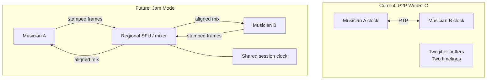
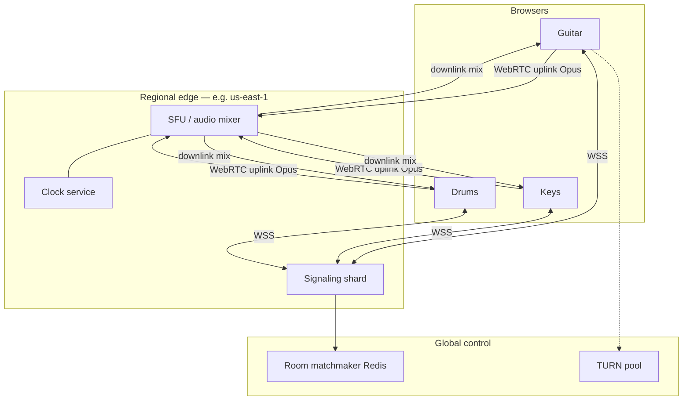
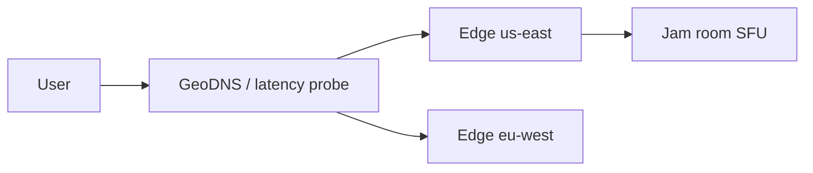

# VoiceLink — Future: Music Jam Mode

**Status:** Architecture proposal (not shipped)  
**Audience:** Technical reviewers asking about real-time jamming, audio synchronization, and platform evolution beyond Omegle-style voice chat.

---

## Table of contents

1. [Product modes](#1-product-modes)
2. [Why plain WebRTC is insufficient for jamming](#2-why-plain-webrtc-is-insufficient-for-jamming)
3. [Latency and geography](#3-latency-and-geography)
4. [Audio synchronization challenges](#4-audio-synchronization-challenges)
5. [Target architecture: Music Jam Mode](#5-target-architecture-music-jam-mode)
6. [Server-side mixing](#6-server-side-mixing)
7. [Time-stamped frames and clock sync](#7-time-stamped-frames-and-clock-sync)
8. [Low-latency routing and edge servers](#8-low-latency-routing-and-edge-servers)
9. [Latency expectations matrix](#9-latency-expectations-matrix)
10. [Phased delivery plan](#10-phased-delivery-plan)
11. [Risks and open research](#11-risks-and-open-research)

---

## 1. Product modes

| Mode | Status | User experience | Media topology |
|------|--------|-----------------|----------------|
| **Random Voice** | ✅ MVP (shipped) | Anonymous 1:1 conversation; optional interest tags | WebRTC peer-to-peer (Opus / DTLS-SRTP) |
| **Music Jam Mode** | 📋 Planned | Room-based session; shared tempo; multi-instrument; low-latency mix | Selective SFU / mixer at regional edge |

Random Voice validates **matchmaking, safety, and musician discovery**. Music Jam Mode is the **differentiator** for serious collaboration — and the primary answer to “can musicians actually play together on this platform?”

---

## 2. Why plain WebRTC is insufficient for jamming

P2P WebRTC between two browsers solves **conversation**. It does **not** solve **ensemble performance**:

| Limitation | Explanation |
|------------|-------------|
| **Independent playout clocks** | Each browser’s jitter buffer runs on local `AudioContext.currentTime` — no shared beat grid |
| **No global mix bus** | Each peer hears a **different** sum of sources with different delays |
| **Asymmetric paths** | A→B and B→A may use different ICE pairs / TURN routes → unequal delay |
| **N-party scaling** | Mesh WebRTC is O(n²) streams — unusable for 4+ musicians |
| **Monitoring latency** | Hearing yourself through partner’s uplink adds RTT — unusable for drums |



**Conclusion:** Jam mode requires a **media server role** (SFU or low-latency mixer), not just better STUN.

---

## 3. Latency and geography

Speed of light sets a **hard floor**. One-way fiber ≈ **1 ms per 200 km** (rough order of magnitude).

| Route | One-way RTT/2 (indicative) |
|-------|---------------------------|
| Same metro | 5–15 ms |
| US coast-to-coast | 35–45 ms |
| US ↔ EU | 70–90 ms |
| US ↔ APAC | 120–180 ms |

**Geographic distance limitations:**

- Global random matching is **wrong** for jam mode — musicians must be matched in **latency regions** (e.g. `us-east`, `eu-west`).
- VoiceLink signaling should expose **region** at connect time (from edge headers or client RTT probe).
- Queue timeout can widen region only after **30–60 s** wait, with explicit UX (“Searching wider area — latency may increase”).

---

## 4. Audio synchronization challenges

### Problems to solve

1. **Clock drift** — device oscillators differ by tens of ppm → streams drift without correction  
2. **Variable packet delay** — jitter buffers hide loss but smear transients (drum attacks)  
3. **Phase alignment** — two guitars on downbeat must hit within **~10–20 ms** perceptually  
4. **Feedback loops** — open mics + speakers incompatible with AEC at jam volumes  

### Strategies (Jam Mode)

| Technique | Purpose |
|-----------|---------|
| **Session master clock** | NTP-like sync via SFU timestamps + RTCP SR |
| **Playout scheduling** | Mix engine schedules all sources to `T + buffer_target` |
| **Adaptive buffer per source** | Minimize delay while avoiding underruns |
| **Optional metronome channel** | Click track encoded once, distributed from server (single source of truth) |
| **Headphone-only policy** | Enforced in UI for jam rooms |

---

## 5. Target architecture: Music Jam Mode



### Room model (proposed)

| Concept | Behavior |
|---------|----------|
| **Jam room** | 2–8 musicians, shared BPM + time signature optional |
| **Roles** | Lead, rhythm, melody — tags for UX only initially |
| **Join** | Matched by region + genre/instrument tags |
| **Leave** | SFU removes source; others’ mix rebalance < 50 ms |

### Signaling extensions (sketch)

| Event | Purpose |
|-------|---------|
| `join-jam-room` | Enter regional queue with instrument profile |
| `jam-room-ready` | SFU endpoint + token |
| `clock-offset` | Client ↔ server offset estimate |
| `transport-cc` | Congestion signals for bitrate |

---

## 6. Server-side mixing

Two viable patterns:

### A. SFU (Selective Forwarding Unit) — preferred first step

- Server **forwards** per-participant streams without re-encoding (low CPU)
- Client or **lightweight mixer plugin** sums streams with aligned timestamps
- Scales to many listeners; musicians hear **customizable** monitor mixes later

### B. MCU / mixer — maximum control

- Server **decodes Opus → PCM → sum → encode** single downlink
- **Pros:** One clock, identical mix for everyone, simplest sync story  
- **Cons:** CPU expensive, generation loss, single codec quality ceiling

### VoiceLink recommendation

| Phase | Topology |
|-------|----------|
| Jam v1 | **SFU** (e.g. mediasoup, LiveKit, Janus) + **server-side metronome** track |
| Jam v2 | Optional **hybrid**: SFU + dedicated low-latency PCM bus for rhythm section |

### Why mixing belongs at the edge

- Keeps RTT low for **all** participants in the room  
- Avoids tromboning (US user → EU SFU → US user)  
- Aligns with [SYSTEM_ARCHITECTURE.md §9](./SYSTEM_ARCHITECTURE.md#9-scaling-strategy) regional strategy  

---

## 7. Time-stamped frames and clock sync

### Time-stamped audio frames

Each uplink RTP packet (or SFU frame) carries:

```text
session_id: uuid
source_id:   musician_id
media_ts:    uint64  // microseconds on session timeline
seq:         uint32
```

Mixer playout function:

```text
playout_time = media_ts + clock_offset(client) + fixed_buffer
```

### Clock synchronization (sketch)

1. Client records `t0` (local), sends ping to edge  
2. Server responds with `t1_server`  
3. Estimate offset θ (NTP-style, multiple samples, discard outliers)  
4. RTCP Sender Reports map RTP timestamp ↔ wall clock  

**Target:** θ uncertainty **< 2 ms** before jam starts; re-sync every 30 s.

### Buffer policy

| Musician role | Buffer target (one-way) |
|---------------|-------------------------|
| Rhythm (drums/bass) | 15–25 ms (aggressive, headphone mandatory) |
| Harmonic (keys/guitar) | 25–40 ms |
| Vocals | 30–50 ms (slightly more jitter tolerance) |

---

## 8. Low-latency routing and edge servers

### Regional edge servers

Deploy **signaling + SFU + TURN** as a **bundle per region**:

| Region code | Example location | Primary users |
|-------------|------------------|---------------|
| `us-east` | Virginia | NA East |
| `us-west` | Oregon | NA West |
| `eu-west` | Dublin | EU |
| `ap-southeast` | Singapore | APAC |

### Routing rules

1. Client performs **RTT probe** to edge candidates on load (or uses GeoDNS).  
2. Binds to **lowest RTT** edge for jam queue.  
3. Matchmaking **never** pairs `us-east` with `ap-southeast` in jam mode (hard reject).  
4. TURN relays **co-located** with SFU — avoid cross-region relay.



### Fallback

If edge SFU at capacity → queue with ETA, or downgrade to **Random Voice** (P2P) with clear latency warning — never silently degrade jam quality.

---

## 9. Latency expectations matrix

### One-way latency classes

| Class | Range | Musician use |
|-------|-------|--------------|
| **Ultra** | **< 20 ms** | Locked tempo jam, drums+bass, tight harmony stacks |
| **Studio-net** | **20–50 ms** | Most real-time collaboration; call-response; loose groove |
| **Wide** | **50–100 ms** | Rehearsal talk + melodic improv; rhythm must lead |
| **Degraded** | **100 ms+** | Conversation, feedback, songwriting talk — **not** beat-critical jam |

### Acceptability by activity

| Activity | Ultra | 20–50 | 50–100 | 100+ |
|----------|-------|-------|--------|------|
| Casual chat | ✅ | ✅ | ✅ | ✅ |
| Pitch / harmony practice | ✅ | ✅ | ⚠️ | ❌ |
| Chord comping behind solo | ✅ | ✅ | ⚠️ | ❌ |
| Locked drum groove | ✅ | ⚠️ | ❌ | ❌ |
| Duo in same tempo (quantized) | ✅ | ⚠️ | ❌ | ❌ |

⚠️ = possible with skilled players and loose genre (e.g. ambient), not product-guaranteed.

### Mode vs technology

| Mode | Typical one-way | Sync quality |
|------|-----------------|--------------|
| Random Voice (P2P) | 25–80 ms | Conversational only |
| Jam Mode (regional SFU) | 15–40 ms target | **Ensemble-viable** |
| Jam Mode (wrong region) | 80–150 ms | Unacceptable — blocked by policy |

---

## 10. Phased delivery plan

| Phase | Deliverable | Depends on |
|-------|-------------|------------|
| **J0** | RTT telemetry in Random Voice | `getStats` pipeline |
| **J1** | Regional signaling shards + match | Redis, GeoDNS |
| **J2** | 3-person SFU pilot room | mediasoup/LiveKit PoC |
| **J3** | Shared metronome + clock sync | SFU + clock service |
| **J4** | Full Jam Mode beta | Monitoring, TURN $, moderation |

**Explicit non-goals for J1–J2:** sample-accurate DAW sync, VST hosting, multi-track recording (different product surface).

---

## 11. Risks and open research

| Risk | Mitigation |
|------|------------|
| SFU ops cost | Start with 1 region; autoscale on concurrent rooms |
| iOS Bluetooth latency | UI warnings; wired interface recommendation |
| Copyright / performance rights | Terms of service; no recording in v1 |
| Abuse in open jam rooms | Report, kick, rate limits, optional trusted rooms |
| Clock sync under load | Cap rooms per SFU CPU; measure playout underruns |

### Open research questions

- Can **WebRTC-NV** or L4S reduce jitter on consumer ISPs?  
- Is **client-side sum** (SFU + Web Audio worklet) lower CPU than server MCU at 4 musicians?  
- How to score **“jam compatibility”** from a 5 s network probe before match?

---

## Engineering narrative for reviewers

> “Today we ship **encrypted P2P voice** with interest-aware matching — the fastest path to musician discovery with minimal infra. We know **rhythmic collaboration** breaks P2P assumptions, so **Music Jam Mode** moves media to **regional SFUs**, introduces a **session clock**, and **time-stamped frames** — the same class of solution used by serious real-time audio products, adapted for browser-first musicians.”

See also: [LOW_LATENCY_AUDIO.md](./LOW_LATENCY_AUDIO.md), [SYSTEM_ARCHITECTURE.md](./SYSTEM_ARCHITECTURE.md).
