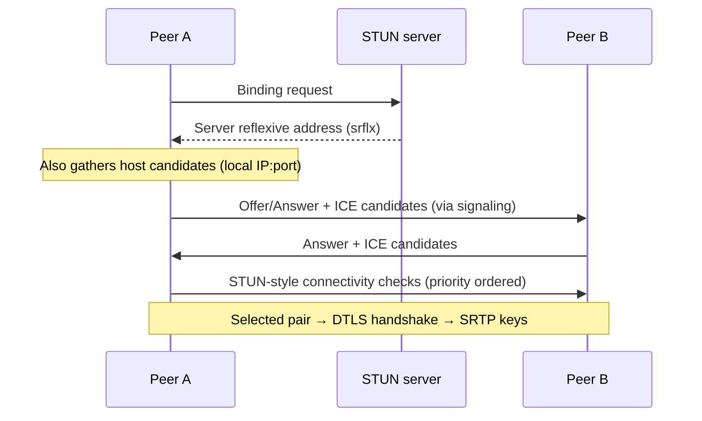

# VoiceLink — Low-Latency Audio Engineering

**Audience:** Reviewers evaluating WebRTC expertise, real-time audio risk, and musician-facing latency requirements.  
**Scope:** Conversational mode (shipped) and constraints that motivate Music Jam Mode (planned).

---

## Table of contents

1. [Why WebRTC](#1-why-webrtc)
2. [How WebRTC reduces latency](#2-how-webrtc-reduces-latency)
3. [ICE, STUN, and TURN](#3-ice-stun-and-turn)
4. [DTLS-SRTP security](#4-dtls-srtp-security)
5. [Jitter buffers and playout](#5-jitter-buffers-and-playout)
6. [Packet loss recovery](#6-packet-loss-recovery)
7. [Browser DSP: AEC, NS, AGC](#7-browser-dsp-aec-ns-agc)
8. [VoiceLink implementation notes](#8-voicelink-implementation-notes)
9. [Latency budgets for musicians](#9-latency-budgets-for-musicians)
10. [Measurement and operations](#10-measurement-and-operations)

---

## 1. Why WebRTC

WebRTC is the **only widely deployed browser API** that combines:

- Sub-100 ms glass-to-glass potential on good networks
- Built-in encryption (DTLS-SRTP)
- Adaptive codecs (Opus) with packet loss concealment
- NAT traversal (ICE) without plugins

### Alternatives considered

| Approach | Pros | Cons | Verdict |
|----------|------|------|---------|
| **WebRTC (chosen)** | Native in Chrome/Safari/Firefox; P2P; encrypted | Complex signaling; jamming needs SFU extension | ✅ MVP + path to SFU |
| WebSocket raw audio | Simple server fan-out | No standard codec/jitter; TLS overhead; you rebuild RTP | ❌ Reinvents RTP poorly |
| HLS / LL-HLS | Great for broadcast | Seconds of latency | ❌ Not interactive |
| WebTransport + custom | Full control | No browser AEC integration; years of edge cases | ❌ Too early for MVP |
| Zoom/Discord SDK | Fast to demo | Vendor lock-in, licensing, less control | ❌ Wrong for owned infra story |

**Decision:** Own signaling (Socket.io) + standards-based media (WebRTC) so we can swap P2P for SFU later without changing the capture API.

---

## 2. How WebRTC reduces latency

WebRTC optimizes for **interactive** audio, not maximum quality at any delay.

### Stack choices that matter

| Mechanism | Effect |
|-----------|--------|
| **UDP transport** | No TCP head-of-line blocking on late packets |
| **Opus codec** | Low algorithmic delay (~5–25 ms depending on mode) |
| **Small frames** | Typically 20 ms packets — balances overhead vs delay |
| **Adaptive bitrate** | Reduces congestion-induced delay spikes |
| **NACK / FEC** | Recovers loss without full retransmit delay |
| **Integrated jitter buffer** | Smooths variance without fixed 500 ms buffers like some music DAWs |

### What WebRTC does *not* guarantee

- Low latency on **bad Wi‑Fi** or **TURN relay across continents**
- **Musical synchronization** between two performers (see [FUTURE_MUSIC_MODE.md](./FUTURE_MUSIC_MODE.md))
- **Multi-party** low latency without an SFU

### VoiceLink conversational path

```
Mic → browser DSP → Opus encode → SRTP → network → jitter buffer → Opus decode → speaker
```

Signaling (Socket.io) is **off the audio hot path** — only SDP/ICE traverse it once per session.

---

## 3. ICE, STUN, and TURN

### ICE (Interactive Connectivity Establishment)

ICE is the **algorithm** that finds a workable network path between peers.



**Candidate types:**

| Type | Meaning |
|------|---------|
| `host` | Local interface — lowest latency when reachable |
| `srflx` | Public IP:port learned via STUN |
| `relay` | Media via TURN — works through symmetric NAT / firewalls |

VoiceLink configures ICE servers in `web/src/lib/webrtc-config.ts`:

- Default: Google public STUN (`stun.l.google.com`)
- Production: add **TURN** via `NEXT_PUBLIC_TURN_URL` + credentials

### STUN

**Session Traversal Utilities for NAT** — answers: “What is my public endpoint?”

- Lightweight UDP request/response
- Does **not** relay media
- Required for most consumer NAT setups

### TURN

**Traversal Using Relays around NAT** — answers: “Relay my packets if direct UDP fails.”

| Aspect | Implication |
|--------|-------------|
| Cost | Bandwidth billed per relayed minute |
| Latency | Extra hop: user → TURN → peer |
| Reliability | Essential for corporate Wi‑Fi, symmetric NAT |
| Security | Must use strong credentials; prefer ephemeral REST API credentials in prod |

**Tradeoff:** Saving TURN cost increases **failed calls** — worse for musician trust than slightly higher infra spend.

---

## 4. DTLS-SRTP security

WebRTC encrypts media with **DTLS-SRTP**:

1. **DTLS handshake** over ICE-selected socket establishes keys.
2. **SRTP** encrypts each RTP packet (confidentiality + integrity).
3. Signaling server sees **SDP** (codec capabilities) but **not** SRTP keys.

| Property | Benefit for musicians |
|----------|----------------------|
| Encryption in transit | Conversations not trivially sniffable on LAN |
| No server decryption in MVP | Privacy posture: we don’t host recordings |
| Browser-enforced | Cannot accidentally ship “HTTP audio” |

**Limitation:** Encryption ≠ moderation. Abuse reporting in VoiceLink is orthogonal to SRTP.

---

## 5. Jitter buffers and playout

Networks deliver packets **irregularly**. A jitter buffer:

1. Holds incoming RTP packets briefly
2. Schedules playout on a **adaptive timeline**
3. Trades **delay vs underrun** (glitches)


### Behavior musicians should understand

- Buffer **shrinks** when network is stable → latency drops
- Buffer **grows** after burst loss → latency spikes temporarily
- **Conversational** WebRTC targets intelligibility, not sample-accurate beat sync

For **jamming**, two independent jitter buffers on two peers means **no shared musical clock** — the fundamental reason Music Jam Mode needs a different architecture.

---

## 6. Packet loss recovery

| Technique | Layer | Effect |
|-----------|-------|--------|
| **NACK** | RTP/WebRTC | Request retransmit of specific packets |
| **FEC** | Opus / WebRTC extensions | Redundant frames reduce audible holes |
| **PLC** | Opus decoder | Synthesizes plausible audio when frame missing |
| **Bitrate adaptation** | GCC / transport CC | Lowers rate before buffer collapse |

### User-perceptible symptoms

| Loss rate | Typical perception |
|-----------|------------------|
| < 1% | Usually transparent with Opus |
| 1–5% | Occasional warble, PLC audible |
| > 10% | Dropouts, robotic artifacts, delay buildup |

VoiceLink does not expose loss stats in UI yet — recommended P2 metric: `RTCInboundRtpStreamStats.packetsLost` / `jitter`.

---

## 7. Browser DSP: AEC, NS, AGC

Applied in the **capture pipeline** before encoding (when enabled in `getUserMedia` constraints).

### Echo cancellation (AEC)

**Problem:** Remote audio from speakers re-enters the mic → partner hears echo.  
**Solution:** Adaptive filter subtracts known playback from mic signal.

| Scenario | AEC quality |
|----------|-------------|
| Headphones | Excellent (minimal leakage) |
| Laptop speakers | Good on modern browsers |
| Loud monitoring + open mic jam | **Poor** — musicians should use headphones |

### Noise suppression (NS)

Attenuates stationary background (fans, AC). Can **color** voice or remove breath transients if aggressive — optional off for “warm vocal” preference in future settings.

### Automatic gain control (AGC)

Normalizes perceived loudness. Helpful for casual chat; **musicians may disable** to preserve dynamics and avoid pumping during quiet passages.

### Recommended future constraint surface

```typescript
audio: {
  echoCancellation: { ideal: true },
  noiseSuppression: { ideal: userPrefs.ns },
  autoGainControl: { ideal: userPrefs.agc },
}
```

---

## 8. VoiceLink implementation notes

| Area | Implementation | Latency impact |
|------|------------------|----------------|
| Signaling | Socket.io over WS | None on steady-state media |
| Negotiation | Trickle ICE + buffered remote candidates | Faster time-to-first-audio |
| Media path | P2P `RTCPeerConnection` | Best case RTT/2 + processing |
| Visualization | `AnalyserNode` + canvas rAF | Zero impact on RTP |
| Mute | `track.enabled = false` | Stops sending — instant |
| Cleanup | `closePeerConnection` on skip | Prevents duplicate streams / CPU |

### Mic preflight

Starting `getUserMedia` **before** `start-search` avoids queue time spent without capture — users hear partners sooner after `matched`.

### iOS playback

Autoplay policies block remote audio until user gesture — `needsAudioUnlock` prevents “connected but silent” support tickets.

---

## 9. Latency budgets for musicians

Round-trip time (RTT) dominates **conversational** delay. One-way ≈ `RTT/2 + encode + jitter + decode + device buffer`.

### Latency tiers

| Range | One-way (approx.) | Experience |
|-------|-------------------|------------|
| **< 20 ms** | Lab/LAN, wired, same city, headphones | Feels like same room; suitable for **tight rhythm** if clocks locked (not true in plain P2P) |
| **20–50 ms** | Excellent internet, direct ICE | **Gold standard** for conversation; acceptable for **loose jam** (chord comping, call-response) |
| **50–100 ms** | Good broadband, some Wi‑Fi | Conversation natural; **rhythm section sync strained** |
| **100 ms+** | Cross-region, TURN, mobile, Bluetooth | Conversation OK with turn-taking; **real-time beat sync impractical** |

### What is acceptable for which activity

| Activity | Acceptable one-way |
|----------|-------------------|
| Talking / networking | < 150 ms |
| Melodic improv (loose) | < 50–80 ms |
| Locked tempo jam (drums + bass) | **< 20–30 ms** + shared clock |
| Studio-quality remote recording | Async (not WebRTC conversational path) |

**Reviewer takeaway:** VoiceLink MVP targets **20–50 ms class on good paths** (industry-realistic for WebRTC voice). **Sub-20 ms rhythmic jam** requires Music Jam Mode infrastructure — not a config tweak.

---

## 10. Measurement and operations

### Browser APIs (recommended instrumentation)

```javascript
const stats = await pc.getStats();
// Inspect: candidate-pair (currentRoundTripTime),
//          inbound-rtp (jitter, packetsLost),
//          outbound-rtp (bytesSent)
```

### KPIs to dashboard

| Metric | Why |
|--------|-----|
| ICE success rate | NAT/TURN configuration health |
| % relay candidates selected | TURN spend + latency penalty |
| Time to `connected` | Signaling + negotiation SLA |
| Post-connect RTT p50/p95 | Musician experience predictor |
| Audio unlock rate (iOS) | UX friction |

### Production checklist

- [ ] Deploy **TURN** in same region as signaling
- [ ] Force **WSS** signaling
- [ ] Monitor p95 RTT; alert if > 120 ms for matched pairs
- [ ] Document headphone recommendation in musician onboarding

---

## Summary for CTO review

VoiceLink uses WebRTC because it is the **correct substrate** for encrypted, interactive browser audio. ICE/STUN/TURN solve connectivity; DTLS-SRTP solves wire security; Opus + jitter buffering solve conversational quality. **Musical synchronization** is a **different problem** — solved in the evolution path documented in [FUTURE_MUSIC_MODE.md](./FUTURE_MUSIC_MODE.md), not by tuning Opus alone.
