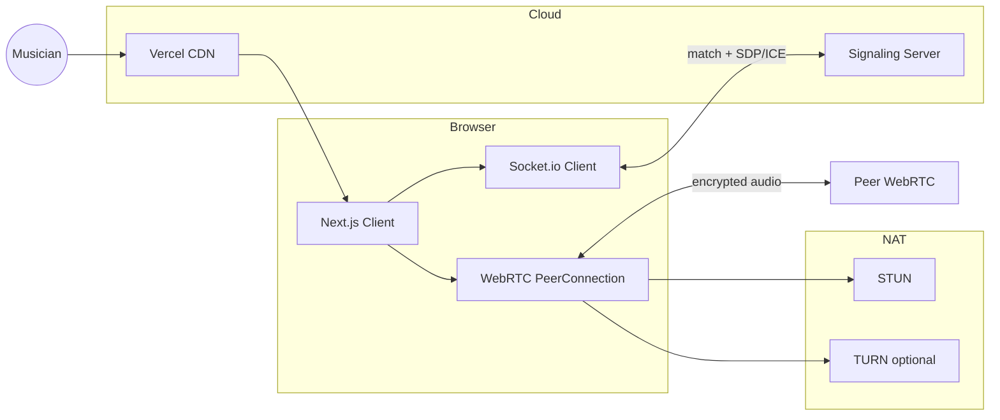

# VoiceLink

**Anonymous, low-latency voice matchmaking for musicians — production-ready MVP with a clear path to real-time collaboration.**

VoiceLink connects singers, instrumentalists, producers, and artists for **encrypted peer-to-peer voice conversations** in the browser. Omegle-style random matching, premium interest selection, in-call RTT monitoring. No accounts, instant skip. Today: discovery and conversation. Tomorrow: **Music Jam Mode** ([FUTURE_MUSIC_MODE.md](./FUTURE_MUSIC_MODE.md)).

| Document | Purpose |
|----------|---------|
| [TESTING_INTERNET_LOCAL_SERVER.md](./TESTING_INTERNET_LOCAL_SERVER.md) | **B on internet, server on your PC — ngrok setup** |
| [TESTING_PARITY.md](./TESTING_PARITY.md) | **Computer A/B — same UI & rules as Vercel users** |
| [DEPLOYMENT.md](./DEPLOYMENT.md) | **Vercel + signaling for all internet users (HTTPS, TURN, env)** |
| [MUSICIAN_PLATFORM.md](./MUSICIAN_PLATFORM.md) | **How to run, deploy, and how musician low-latency mode works** |
| [SYSTEM_ARCHITECTURE.md](./SYSTEM_ARCHITECTURE.md) | Diagrams, matchmaking, signaling, deployment, scaling |
| [LOW_LATENCY_AUDIO.md](./LOW_LATENCY_AUDIO.md) | WebRTC, ICE, jitter, DSP, latency budgets |
| [FUTURE_MUSIC_MODE.md](./FUTURE_MUSIC_MODE.md) | Jam mode SFU, clock sync, edge routing |

---

## Technical highlights

| Capability | Implementation |
|------------|----------------|
| **WebRTC audio streaming** | Musician constraints, Opus preference, DTLS-SRTP P2P; RTT badge in-call |
| **Socket.io signaling** | SDP/ICE relay, match events, presence; Node 20 long-running service |
| **Interest-based matchmaking** | Tag overlap scoring + random fallback; initiator glare avoidance |
| **Real-time presence system** | `platform-stats` — live online / waiting / in-call (never fabricated) |
| **Mobile responsive design** | `dvh` layout, safe areas, tap-to-unlock remote audio (iOS) |
| **Audio optimization** | Mic preflight, shared `AudioContext` analysers, canvas waveforms (rAF, no React hot path) |

**Stack:** Next.js 16 · React 19 · TypeScript · Tailwind CSS 4 · Socket.io 4 · WebRTC

---

## Engineering decisions

Each major technology choice below reflects deliberate tradeoffs — the kind of reasoning expected when presenting to a startup CTO.

### WebRTC for media (not WebSocket audio)

| | |
|---|---|
| **Why chosen** | Browser-native sub-100 ms conversational latency, Opus + PLC + jitter buffer, mandatory DTLS-SRTP |
| **Alternatives** | Raw WebSocket PCM (reinvent RTP); HLS (seconds of delay); third-party SDKs (lock-in) |
| **Tradeoff** | Signaling complexity and NAT/TURN ops; jamming later requires SFU extension |

→ Deep dive: [LOW_LATENCY_AUDIO.md §1–2](./LOW_LATENCY_AUDIO.md#1-why-webrtc)

### Socket.io for signaling (not raw WebSocket)

| | |
|---|---|
| **Why chosen** | Reconnection, fallbacks, room broadcast for `platform-stats`, fast MVP iteration |
| **Alternatives** | Raw WS + custom protocol; gRPC-Web; WebTransport |
| **Tradeoff** | Heavier than minimal WS; horizontal scale needs Redis adapter |

→ Flow: [SYSTEM_ARCHITECTURE.md §6](./SYSTEM_ARCHITECTURE.md#6-webrtc-signaling-flow)

### Peer-to-peer topology (not SFU) for MVP

| | |
|---|---|
| **Why chosen** | Zero server media cost; lowest latency on good paths; privacy (no server decode) |
| **Alternatives** | SFU/MCU day one (ops cost before product-market fit) |
| **Tradeoff** | No beat sync, poor multi-party scaling, TURN-dependent on hard NAT |

→ Evolution: [FUTURE_MUSIC_MODE.md](./FUTURE_MUSIC_MODE.md)

### In-memory matchmaking (not Redis) for MVP

| | |
|---|---|
| **Why chosen** | Single signaling instance, O(n) queue acceptable at thousands of waiters, simplest correctness |
| **Alternatives** | Redis queues + Lua atomic match; dedicated matchmaking service |
| **Tradeoff** | No horizontal scale until P1; process restart clears queue |

→ Scale path: [SYSTEM_ARCHITECTURE.md §9](./SYSTEM_ARCHITECTURE.md#9-scaling-strategy)

### Interest overlap scoring (not ML ranking)

| | |
|---|---|
| **Why chosen** | Explainable, deterministic, low CPU; fits musician tag discovery |
| **Alternatives** | Elo/skill matching; embeddings; graph recommendations |
| **Tradeoff** | Cold-start random pairs; no “taste” learning yet |

→ Algorithm: [SYSTEM_ARCHITECTURE.md §5](./SYSTEM_ARCHITECTURE.md#5-matchmaking-architecture)

### Next.js on Vercel + Node signaling on PaaS

| | |
|---|---|
| **Why chosen** | Edge CDN for UI; WebSockets require long-lived Node (not serverless functions) |
| **Alternatives** | Monolith; Cloudflare Workers (WS limits); embedded signaling in Next |
| **Tradeoff** | Two deploy targets; CORS/origin discipline |

→ Deploy: [SYSTEM_ARCHITECTURE.md §8](./SYSTEM_ARCHITECTURE.md#8-deployment-architecture)

### Canvas + Web Audio for visualization (not per-frame React state)

| | |
|---|---|
| **Why chosen** | 60 fps waveforms without re-rendering React tree; shared analyser refcounting |
| **Alternatives** | `requestAnimationFrame` → `setState` (CPU + jank) |
| **Tradeoff** | More custom code; no SSR for canvas paths |

### Public STUN + optional TURN env

| | |
|---|---|
| **Why chosen** | Free STUN for dev; production TURN injected without code changes |
| **Alternatives** | TURN-only; corporate VPN-specific servers |
| **Tradeoff** | Google STUN dependency in dev; prod **must** add TURN for reliability |

→ ICE: [LOW_LATENCY_AUDIO.md §3](./LOW_LATENCY_AUDIO.md#3-ice-stun-and-turn)

---

## Project overview

| | |
|---|---|
| **Product** | Omegle-inspired **musician voice discovery** — modern UX, interest cards |
| **Users** | Anonymous visitors (18+ recommended) |
| **Frontend** | Next.js 16, React 19, TypeScript, Tailwind CSS 4 |
| **Signaling** | Node.js 20, Express, Socket.io 4 |
| **Media** | WebRTC audio (DTLS-SRTP), STUN + optional TURN |

### What runs where

- **Browser** — UI, microphone, `RTCPeerConnection`, voice-activity indicators.
- **Signaling server** — Queue, interest-aware matching, SDP/ICE relay (**no audio**).
- **STUN/TURN** — NAT traversal (public STUN in dev; **TURN required for production reliability**).

---

## Architecture (summary)



Full diagrams: [SYSTEM_ARCHITECTURE.md §2–7](./SYSTEM_ARCHITECTURE.md).

---

## Features

| Feature | Description |
|---------|-------------|
| Anonymous join | No signup; ephemeral Socket.io session id |
| Premium interest selection | Responsive card grid, animated summary, dynamic CTAs |
| Interest tags | Up to 10 tags; overlap prioritized in queue |
| Random fallback | No overlap → random pairing |
| Real-time voice | WebRTC audio-only, encrypted in transit |
| Mute / unmute | `MediaStreamTrack.enabled` |
| Skip / End | Re-queue or leave entirely |
| Voice activity | Local + remote speaking indicators |
| Rate limits | `start-search`, `skip`, `report` per socket |
| Reports | Anonymous, rate-limited, log-only MVP |
| Live stats | Real network counts when connected |

---

## Latency expectations (musician-relevant)

| One-way delay | Typical use on VoiceLink |
|---------------|--------------------------|
| **< 20 ms** | Same-region, direct ICE, headphones — tightest jam feel (Jam Mode target) |
| **20–50 ms** | **MVP sweet spot** for natural conversation and loose musical exchange |
| **50–100 ms** | Workable talk; rhythm lock difficult |
| **100 ms+** | Turn-taking conversation; not suitable for tempo-locked jam |

Plain P2P cannot guarantee ensemble sync — see [FUTURE_MUSIC_MODE.md §9](./FUTURE_MUSIC_MODE.md#9-latency-expectations-matrix).

---

## Repository layout

```
Hinabi/
├── web/                      # Next.js frontend
├── server/                   # Signaling + matchmaking
├── SYSTEM_ARCHITECTURE.md
├── LOW_LATENCY_AUDIO.md
├── FUTURE_MUSIC_MODE.md
├── DEVELOPMENT.md
└── README.md
```

---

## Security considerations

| Area | Status | Notes |
|------|--------|-------|
| Media encryption | ✅ | DTLS-SRTP peer-to-peer |
| Signaling TLS | ⚠️ | WSS required in production |
| Rate limiting | ✅ | Per-socket sliding windows |
| Identity | ✅ | No accounts; ephemeral socket ids |
| TURN secrets | ⚠️ | Prefer short-lived credentials in prod |

Details: [SYSTEM_ARCHITECTURE.md §10](./SYSTEM_ARCHITECTURE.md#10-safety-security-and-operations).

---

## Scalability (summary)

| Dimension | Today | Next step |
|-----------|-------|-----------|
| Matchmaking | In-memory, single process | Redis queue + atomic match |
| Socket.io | Single node | Redis adapter |
| Media | P2P only | Regional TURN; SFU for Jam Mode |
| Regions | Single deployment | Geo-sharded signaling + edge SFU |

Audio **does not** scale signaling bandwidth — only connections and match CPU do.

---

## Known limitations

- Matchmaking is **single-instance** (no horizontal scale yet).
- Reports are **logged only** — no moderation dashboard.
- P2P may fail on restrictive NAT without **TURN**.
- **No musical clock sync** in MVP (by design — see Jam Mode doc).

## Roadmap

- [x] Rate limiting and anonymous reporting
- [x] Premium interest selection UX
- [ ] Production TURN with ephemeral credentials (P0)
- [ ] Redis-backed matchmaking + Socket.io cluster (P1)
- [ ] RTT / ICE quality telemetry (P2)
- [ ] Music Jam Mode SFU pilot (P3) — [FUTURE_MUSIC_MODE.md](./FUTURE_MUSIC_MODE.md)

---

## Deploy for all internet users (Vercel)

1. Deploy **`server/`** to Railway/Render (public HTTPS URL).  
2. Deploy **`web/`** to Vercel (root directory = `web`).  
3. Set Vercel env: `NEXT_PUBLIC_SOCKET_URL=https://YOUR-SIGNALING-URL`  
4. Set signaling env: `CLIENT_ORIGIN=https://YOUR-APP.vercel.app` (or `*`)  
5. Add **TURN** env vars on Vercel for reliable global voice.  

Full step-by-step: **[DEPLOYMENT.md](./DEPLOYMENT.md)**

---

## Quick start

**Prerequisites:** Node.js 20+, npm 10+

```bash
git clone <repo-url>
cd Hinabi
npm install
npm install --prefix web
npm install --prefix server

cp web/.env.example web/.env.local
cp server/.env.example server/.env
```

See **[DEVELOPMENT.md](./DEVELOPMENT.md)** for manual dev server workflow.

```bash
# Terminal 1
npm run dev:server

# Terminal 2
npm run dev:web
```

| Service | URL |
|---------|-----|
| Web | http://localhost:3000 |
| Signaling | http://localhost:3001 |
| Health | http://localhost:3001/health |

### Environment variables

| Variable | App | Description |
|----------|-----|-------------|
| `NEXT_PUBLIC_SOCKET_URL` | web | Signaling URL (**required in prod**) |
| `NEXT_PUBLIC_TURN_URL` | web | Optional TURN server |
| `NEXT_PUBLIC_TURN_USERNAME` | web | TURN username |
| `NEXT_PUBLIC_TURN_CREDENTIAL` | web | TURN credential |
| `PORT` | server | Listen port (default `3001`) |
| `HOST` | server | Bind address (`0.0.0.0` in cloud) |
| `CLIENT_ORIGIN` | server | Comma-separated allowed origins |

### Scripts

| Command | Description |
|---------|-------------|
| `npm run dev` | Web + signaling (one terminal) |
| `npm run dev:web` | Frontend only |
| `npm run dev:server` | Signaling only |
| `npm run stop` | Free ports 3000 / 3001 (Windows) |
| `npm run build` | Production build (both) |

---

## Interview talking points

Use these when a reviewer asks *“why should we trust you with real-time audio?”*

1. **We separate control plane and media plane** — signaling scales like a chat server; audio scales like a CDN problem (P2P today, SFU tomorrow).
2. **We know P2P limits** — conversational WebRTC ≠ jamming; Jam Mode is designed with SFU + session clock, not marketing fluff.
3. **We measure what matters** — RTT, ICE candidate types, jitter (roadmap); we don’t fake “2,341 active” per interest.
4. **We optimize the browser hot path** — mic preflight, no React in audio viz loop, polite SDP negotiation.
5. **We ship honest MVPs** — in-memory queue is a deliberate scale trade, documented with Redis migration plan.

---

## License

MIT
