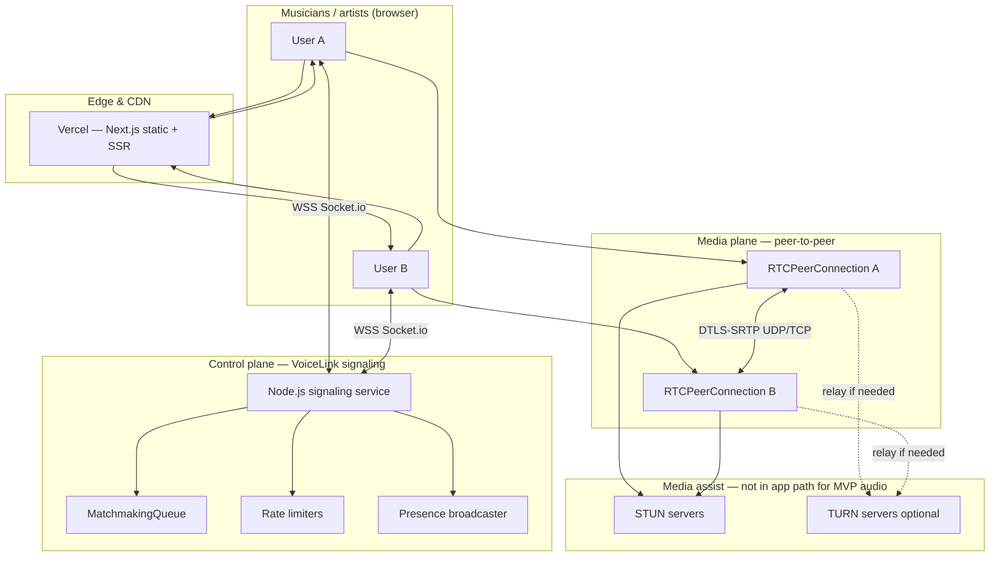
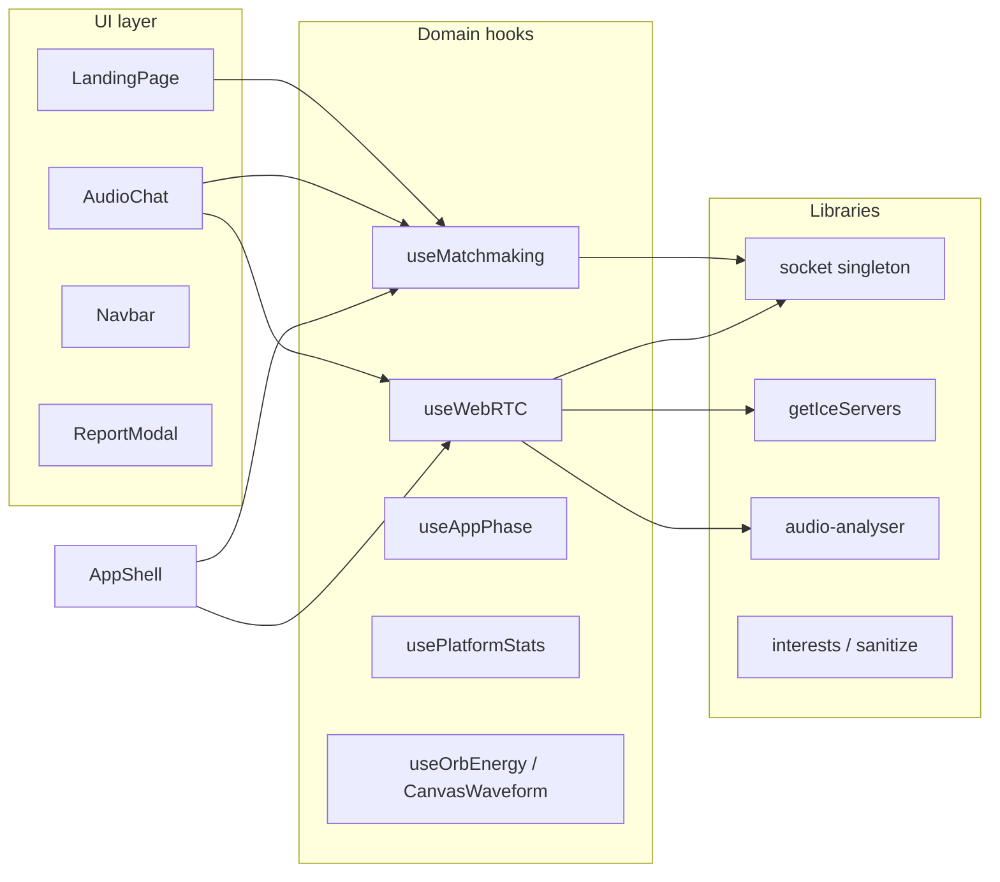
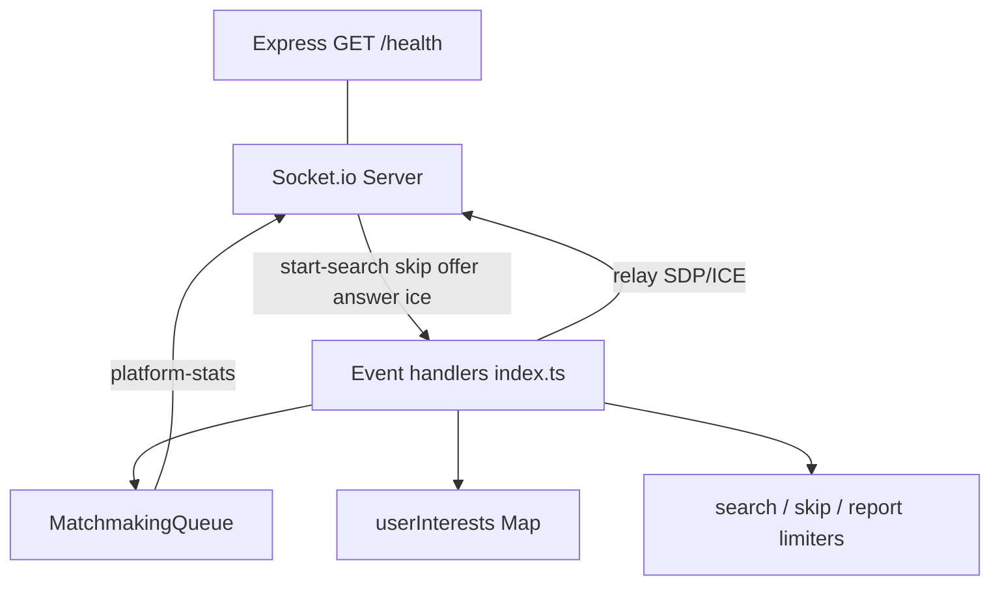
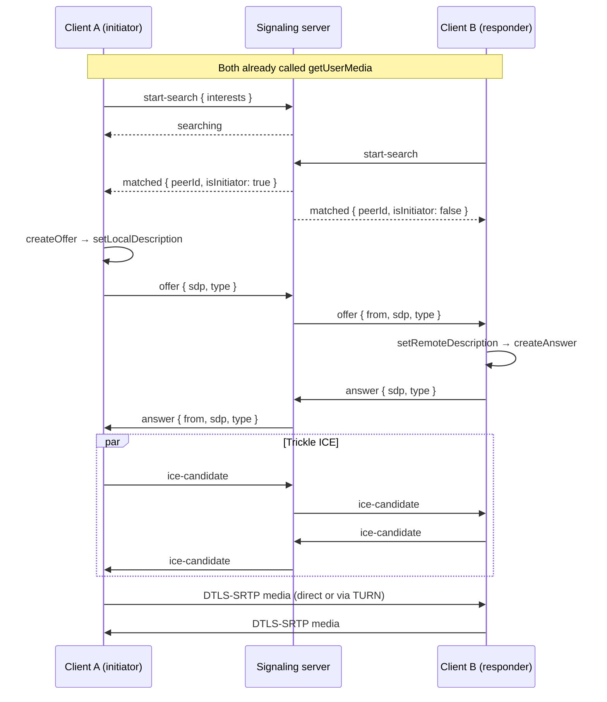
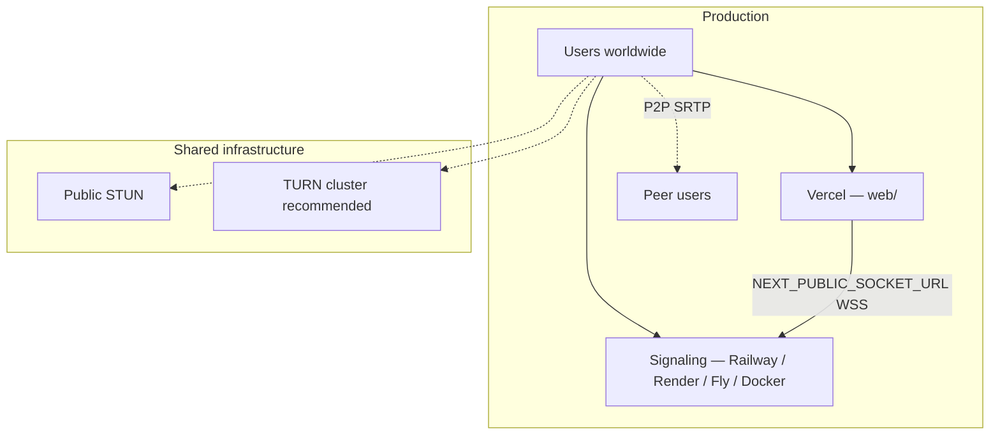
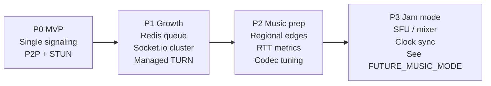

# VoiceLink — System Architecture

**Audience:** Engineers, operators, and technical reviewers evaluating real-time audio infrastructure.  
**Product vision:** Omegle-inspired **anonymous voice matchmaking for musicians** — singers, instrumentalists, producers, and artists discovering collaborators through low-latency conversation today, with a path to synchronized jamming tomorrow.  
**Codebase status:** Production-oriented MVP (P2P voice, in-memory matchmaking, single signaling instance).

**Related documents:**

- [LOW_LATENCY_AUDIO.md](./LOW_LATENCY_AUDIO.md) — WebRTC, ICE, jitter, DSP, and latency budgets
- [FUTURE_MUSIC_MODE.md](./FUTURE_MUSIC_MODE.md) — Music Jam Mode (SFU mixing, clock sync, edge routing)

---

## Table of contents

1. [Executive summary](#1-executive-summary)
2. [High-level architecture](#2-high-level-architecture)
3. [Frontend architecture](#3-frontend-architecture)
4. [Backend architecture](#4-backend-architecture)
5. [Matchmaking architecture](#5-matchmaking-architecture)
6. [WebRTC signaling flow](#6-webrtc-signaling-flow)
7. [Audio streaming flow](#7-audio-streaming-flow)
8. [Deployment architecture](#8-deployment-architecture)
9. [Scaling strategy](#9-scaling-strategy)
10. [Safety, security, and operations](#10-safety-security-and-operations)
11. [Repository map](#11-repository-map)

---

## 1. Executive summary

VoiceLink separates **control plane** (who talks to whom) from **media plane** (how audio moves). The signaling server never processes audio samples; browsers exchange encrypted RTP directly via WebRTC after SDP/ICE negotiation relayed over Socket.io.

| Plane | Technology | Responsibility |
|-------|------------|----------------|
| **Presentation** | Next.js 16, React 19 | Landing, interest selection, in-call UX |
| **Signaling** | Node 20, Express, Socket.io 4 | Matchmaking, SDP/ICE relay, presence stats |
| **Media** | WebRTC (DTLS-SRTP) | Opus-encoded audio, peer-to-peer by default |
| **NAT traversal** | STUN (+ optional TURN) | ICE candidate discovery and relay fallback |

**Current mode:** Random 1:1 voice conversations with optional musician interest tags (gaming, music, coding, etc. — extensible to instrument/genre tags).  
**Future mode:** Music Jam Mode with server-side mixing and clock synchronization — see [FUTURE_MUSIC_MODE.md](./FUTURE_MUSIC_MODE.md).

### Architectural invariants

1. **Audio stays off the application server** in MVP — minimizes cost and keeps conversational latency near physical RTT limits.
2. **Signaling is stateful** — queues and pair maps require long-lived WebSocket connections, not serverless functions.
3. **Initiator determinism** — lexicographic `socketId` ordering prevents dual-offer glare during WebRTC negotiation.
4. **Honest presence** — `platform-stats` reflects live socket counts only; no fabricated per-interest numbers.

---

## 2. High-level architecture



### Traffic classification

| Path | Protocol | Payload | Latency sensitivity |
|------|----------|---------|---------------------|
| Page load | HTTPS | HTML/JS/CSS | Low |
| Signaling | WebSocket (Socket.io) | JSON events, SDP, ICE | Medium |
| ICE discovery | STUN binding | Small UDP | Medium |
| Voice media | SRTP (via WebRTC) | Opus frames ~20 ms | **Critical** |
| TURN relay | TURN → SRTP | Same as media | **Critical** (+ relay hop) |

---

## 3. Frontend architecture

The web client (`web/`) is a **single-page experience** orchestrated by `AppShell.tsx`: landing → session (matchmaking + WebRTC) with dynamic imports for heavy in-call modules.



### Key modules

| Path | Role |
|------|------|
| `components/AppShell.tsx` | View routing (`landing` \| `session`), mic preflight, pending search after `getUserMedia`, skip/end/report |
| `components/LandingPage.tsx` | Omegle-style hero + `InterestSelectionPanel` |
| `components/InterestSelectionPanel.tsx` | Premium interest grid, dynamic CTAs |
| `hooks/useMatchmaking.ts` | Socket events → `idle` / `searching` / `connected` / `disconnected` |
| `hooks/useWebRTC.ts` | `RTCPeerConnection`, perfect negotiation pattern, ICE buffering, cleanup |
| `hooks/usePlatformStats.ts` | Subscribes to `platform-stats` for live counters |
| `lib/webrtc-config.ts` | STUN + optional TURN from env |
| `lib/audio-analyser.ts` | Shared `AudioContext`, refcounted analysers for waveforms (no per-frame React state) |
| `components/CanvasWaveform.tsx` | rAF-driven canvas viz (GPU-friendly) |

### Client design choices for latency UX

- **Mic preflight before queue** — `prepareForCall()` runs in the user gesture handler so `getUserMedia` completes before `start-search`, avoiding “matched but no mic” races.
- **One peer connection per partner** — `teardownPeer` before renegotiation prevents zombie PCs after skip.
- **Remote playback unlock** — iOS requires explicit `audio.play()` after user gesture; `needsAudioUnlock` surfaces tap-to-hear.
- **Reduced motion** — Framer Motion respects `prefers-reduced-motion` on interest cards and hero animations.

### Frontend runtime boundaries

| Runs on main thread | Runs in browser media pipeline |
|--------------------|--------------------------------|
| React UI, Socket.io | `getUserMedia`, AEC/NS/AGC (browser DSP) |
| Canvas waveform rAF | Opus encode/decode, jitter buffer |
| SDP JSON over socket | DTLS-SRTP encrypt/decrypt |

---

## 4. Backend architecture

The signaling service (`server/`) is a **long-running Node process**: Express for health checks, Socket.io attached to the same HTTP server.



### Server modules

| File | Responsibility |
|------|----------------|
| `index.ts` | CORS, connection lifecycle, event routing, rate-limit responses |
| `matchmaking.ts` | Queue, interest scoring, symmetric `pairs` map, initiator bit |
| `sanitize.ts` | Interest tag normalization (length, charset, blocklist) |
| `rateLimit.ts` | Per-socket sliding windows (`start-search` 12/min, `skip` 30/min, `report` 5/5min) |
| `stats.ts` | `online`, `waiting`, `inCall` from `io.engine.clientsCount` + queue |

### What the server does **not** do

- Decode or mix audio
- Store user accounts or PII (reports log reason + ephemeral socket ids)
- Terminate TLS for WebRTC media (browser ↔ STUN/TURN/peer only)

### Stateful in-memory structures (single instance)

```
queue: QueuedUser[]                    // { socketId, interests[], joinedAt }
pairs: Map<socketId, peerId>           // bidirectional active calls
userInterests: Map<socketId, string[]> // last tags for skip re-queue
rate buckets: Map<socketId, Bucket>    // per-action counters
```

---

## 5. Matchmaking architecture

Matchmaking is **interest-aware random pairing**: musicians with overlapping tags prefer each other; otherwise the system degrades to global random matching (fairness for cold-start queues).

```mermaid
flowchart TD
  IN[start-search] --> SAN[sanitizeInterests max 10]
  SAN --> PAIRED{Already in pair?}
  PAIRED -->|yes| UNPAIR[unpair + peer-disconnected]
  PAIRED -->|no| TRY[tryMatch]
  UNPAIR --> TRY
  TRY --> EMPTY{Other waiters?}
  EMPTY -->|no| ENQ[enqueue socketId]
  EMPTY -->|yes| TAGS{Incoming has tags?}
  TAGS -->|yes| OVERLAP{Any score > 0?}
  OVERLAP -->|yes| BEST[Random among max |A ∩ B| tier]
  OVERLAP -->|no| RAND[Random waiter]
  TAGS -->|no| RAND
  BEST --> PAIR[Symmetric pairs map]
  RAND --> PAIR
  PAIR --> EMIT[matched × 2 + sharedInterests]
  ENQ --> WAIT[Emit searching]
```

### Scoring function

```text
interestMatchScore(A, B) = |A ∩ B|   // tags lowercased, deduped server-side
```

### Initiator selection (glare avoidance)

```text
isInitiator(a, b) = (a.localeCompare(b) < 0)
```

Exactly one peer creates the SDP offer; the other answers. This is stable for the lifetime of a socket id pair.

### Operational parameters

| Parameter | Default | Purpose |
|-----------|---------|---------|
| `STALE_QUEUE_MS` | 10 min | Remove abandoned waiters |
| Prune interval | 60 s | Queue hygiene |
| Max interests | 10 | Abuse + match CPU bound |

### Future matchmaking (musician scale)

- **Skill / instrument facets** — separate tag namespaces (`instrument:guitar`, `genre:jazz`)
- **Regional affinity** — match within same signaling region before global fallback (latency)
- **Redis sorted sets** — O(log N) queue ops across instances (see [§9](#9-scaling-strategy))

---

## 6. WebRTC signaling flow

Signaling is **application-defined over Socket.io** — not SIP. Payloads are typed in `web/src/types/socket.ts` and mirrored server-side.



### Perfect negotiation (client)

`useWebRTC.ts` implements polite/impolite roles using `isInitiator` to ignore glare offers during reconnection. Pending ICE candidates buffer until `remoteDescription` is set — standard trickle ICE robustness.

### Signaling event reference

| Direction | Event | Purpose |
|-----------|--------|---------|
| C → S | `start-search` | Join queue with `interests[]` |
| C → S | `stop-search` | Leave queue / end pair |
| C → S | `skip` | Unpair + re-queue with saved interests |
| C → S | `offer` / `answer` / `ice-candidate` | WebRTC negotiation |
| C → S | `report` | Anonymous abuse report |
| S → C | `searching` | Waiting |
| S → C | `matched` | `{ peerId, isInitiator, sharedInterests? }` |
| S → C | `peer-disconnected` | Partner left / skip |
| S → C | `platform-stats` | Live presence |
| S → C | `rate-limited` | Throttle feedback |

---

## 7. Audio streaming flow

End-to-end audio path for **conversational mode** (current product):

```mermaid
flowchart LR
  MIC[Microphone] --> CAP[Browser capture pipeline]
  CAP --> DSP[AEC / NS / AGC optional]
  DSP --> ENC[Opus encoder WebRTC]
  ENC --> RTP[RTP packetizer]
  RTP --> SRTP[DTLS-SRTP]
  SRTP --> NET[UDP direct or TURN relay]
  NET --> SRTP2[Peer decrypt]
  SRTP2 --> JIT[Jitter buffer]
  JIT --> DEC[Opus decode]
  DEC --> SPK[Remote audio element]
```



### Capture constraints (MVP)

```javascript
// Simplified — actual constraints in useWebRTC prepareForCall
getUserMedia({ audio: true })
```

Production musician builds may add:

```javascript
audio: {
  echoCancellation: true,
  noiseSuppression: true,
  autoGainControl: true,
  channelCount: 1,
  sampleRate: 48000,  // when supported
}
```

### Codec and timing

| Layer | Typical behavior |
|-------|------------------|
| Codec | Opus (WebRTC default), ~20 ms frames |
| One-way glass-to-glass (P2P, good NAT) | Often **40–120 ms** + device buffer |
| TURN relay | +20–80 ms depending on region |
| Bluetooth headset | +100–200 ms additional |

Detailed analysis: [LOW_LATENCY_AUDIO.md](./LOW_LATENCY_AUDIO.md).

### Client-side monitoring (non-blocking)

- **AnalyserNode** reads frequency data for waveforms — does not touch RTP path.
- **Voice activity** derived from analyser energy thresholds — UX only, not sent to server.

---

## 8. Deployment architecture



### Frontend (Vercel)

| Setting | Value |
|---------|--------|
| Root directory | `web/` |
| Required env | `NEXT_PUBLIC_SOCKET_URL` → signaling WSS origin |
| Optional | `NEXT_PUBLIC_TURN_*` for restrictive NAT |

### Signaling (container / PaaS)

| Setting | Value |
|---------|--------|
| Process | `node` long-running, **not** serverless |
| Bind | `HOST=0.0.0.0`, `PORT` from platform |
| CORS | `CLIENT_ORIGIN` comma-separated allowlist |
| Health | `GET /health` → queue depth, online count |

```bash
cd server && docker build -t voicelink-signaling .
docker run -p 3001:3001 -e CLIENT_ORIGIN=https://app.example.com voicelink-signaling
```

### TLS requirements

| Link | Requirement |
|------|-------------|
| App → signaling | **WSS** in production |
| WebRTC | Browsers require secure context for `getUserMedia` |
| TURN | TLS/TCP or UDP with long-term credentials |

---

## 9. Scaling strategy

### Dimension analysis

| Dimension | Bottleneck today | Horizontal scale path |
|-----------|------------------|------------------------|
| **Concurrent sockets** | Single Node event loop | Socket.io Redis adapter + sticky sessions |
| **Matchmaking CPU** | O(n) scan per `tryMatch` | Redis queue shards by region/tag |
| **Memory** | In-memory maps | Externalize queue + pairs to Redis |
| **Media bandwidth** | **Not on signaling server** (P2P) | TURN cluster; future SFU for jam mode |
| **Geography** | Single region | Multi-region signaling + **match locally first** |

### Phase roadmap



### P1: Multi-instance signaling

1. **Redis adapter** for Socket.io — broadcast `offer`/`ice-candidate` to the process holding the peer socket.
2. **Atomic match pop** — `LPOP` two waiters or Lua script to prevent double pairing.
3. **Sticky load balancing** — IP hash or session cookie so reconnect hits same node (optional if Redis covers relay).

### P2: Musician-oriented latency

- Deploy signaling in **us-east, eu-west, ap-southeast** (example).
- Match users only within region unless queue timeout > 30 s.
- Publish **ICE connection stats** (candidate pair RTT) to analytics — detect TURN overuse.

### P3: Media plane scale

Peer-to-peer does not scale to **multi-party jam sessions** — SFU required. Architecture in [FUTURE_MUSIC_MODE.md](./FUTURE_MUSIC_MODE.md).

### Capacity order-of-magnitude (single 2 vCPU signaling node)

| Workload | Rough capacity |
|----------|----------------|
| Idle connected sockets | 10k–50k (mostly memory bound) |
| `tryMatch` per second | Hundreds (linear queue scan) |
| Audio streams | **0** on server (P2P) |

---

## 10. Safety, security, and operations

| Control | Implementation |
|---------|----------------|
| Media encryption | DTLS-SRTP (mandatory in WebRTC) |
| Signaling transport | TLS/WSS in prod |
| Abuse | Rate limits + anonymous `report` event |
| Interest injection | `sanitize.ts` charset + blocklist |
| CORS | Explicit origin allowlist |

**Threat model gaps (honest):** no CAPTCHA, no persistent bans, reports are log-only, no content moderation (audio never hits server in MVP).

### Observability

- `GET /health` — online, waiting, inCall, report count
- Server logs — connection, match, rate-limit (avoid full SDP in prod logs)

---

## 11. Repository map

```
Hinabi/
├── web/                      # Next.js frontend
│   └── src/
│       ├── components/       # UI, interest selection, AudioChat
│       ├── hooks/            # matchmaking, WebRTC, stats
│       └── lib/              # socket, webrtc-config, audio-analyser
├── server/                   # Signaling + matchmaking
│   └── src/
│       ├── index.ts
│       ├── matchmaking.ts
│       ├── rateLimit.ts
│       └── stats.ts
├── SYSTEM_ARCHITECTURE.md      # This document
├── LOW_LATENCY_AUDIO.md        # WebRTC & DSP deep dive
├── FUTURE_MUSIC_MODE.md        # Jam mode evolution
├── DEVELOPMENT.md
└── README.md
```

---

*This architecture is designed to satisfy reviewers asking about WebRTC, latency, synchronization, jamming, and scale — while clearly separating what ships today from what the platform evolves into next.*
